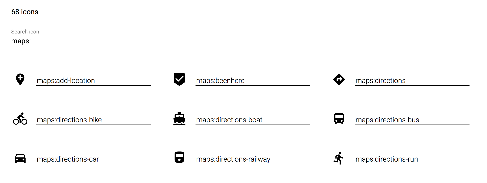

# &lt;demo-iconset&gt;

[](https://www.webcomponents.org/element/kcmr/demo-iconset/)

> A demo helper component to showcase a Polymer iconset. 

**Demo:** [https://kcmr.github.io/demo-iconset/](https://kcmr.github.io/demo-iconset/)

[](https://kcmr.github.io/demo-iconset/)

This component displays the icons of a Polymer iconset with an input to filter the results and an optional text with the total of icons.


## Installation and usage

Install the component using Bower:

```
bower i -S demo-iconset
```

Import Web Components polyfill:

```html
<script src="<path-to-components>/webcomponentsjs/webcomponents-lite.js"></script>
```

Import the component and the Polymer Iconset to show:

```html
<link rel="import" href="<path-to-components>/my-icons/my-icons.html">
<link rel="import" href="<path-to-components>/demo-iconset/demo-iconset.html">
```
Use it!

```html
<demo-iconset iconset="my-icons"></demo-iconset>
```

## Compatibility

The component is an Hybrid Polymer element **compatible with Polymer 1.x and 2.x** elements.   
It will be migrated to a class-based element in the future.

## Properties

| Property         | Type    | Description                     | Default value |
| :--------------- | :------ | :------------------------------ | :------------ |
| iconset          | String  | Name of the iconset to be shown |               |
| iconSize         | Number  | Size for the icons              | 32            |
| showTotal        | Boolean | Show the total of icons         | false         |
| icons (readOnly) | Array   | List of icons                   |               |


## Styling

The following custom properties and mixins are available for styling:

| Custom property                     | Description                                                                   | Default       |
| :---------------------------------- | :---------------------------------------------------------------------------- | :------------ |
| --demo-iconset                      | Empty mixin applied to :host                                                  | {}            |
| --demo-iconset-primary-color        | Primary text color                                                            | #000          |
| --demo-iconset-secondary-color      | Secondary color used for :focus, :hover and selections                        | rebeccapurple |
| --demo-iconset-icon-meta            | Empty mixin applied to the wrapper of the search input and the total of icons | {}            |
| --demo-iconset-icons                | Empty mixin applied to the icon list wrapper                                  | {}            |
| --demo-iconset-item                 | Empty mixin applied to each icon list item with the label, icon and input     | {}            |
| --demo-iconset-item-hover           | Empty mixin applied to each icon list item for the :hover state               | {}            |
| --demo-iconset-item-at-730          | Empty mixin applied to each icon list item at @media (min-width: 730px)       | {}            |
| --demo-iconset-item-at-1600         | Empty mixin applied to each icon list item at @media (min-width: 1600px)      | {}            |
| --demo-iconset-item-icon            | Empty mixin applied to each icon in the list                                  | {}            |
| --demo-iconset-item-input           | Empty mixin applied to each input in the list                                 | {}            |
| --demo-iconset-item-input-selection | Empty mixin applied to each input in the list for text selection              | {}            |
| --demo-iconset-item-input-focus     | Empty mixin applied to each input in the list for the :focus state            | {}            |
